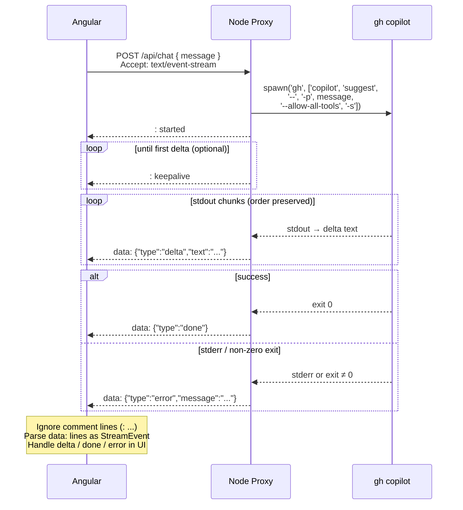

# Architecture: Chat UI with streamed agent responses

**Feature**: Chat UI with streamed agent responses (backend integration)  
**Date**: 2026-02-22  

---

## 1. Overview

The system is a chat UI that streams agent responses. The “agent” is **GitHub Copilot CLI** (`gh copilot`); there is no custom LLM. A **Node proxy** in the same repo receives messages from the Angular app, spawns the Copilot CLI, and streams the output back over **SSE**. The frontend already supports streaming (delta/done/error); the backend integration will feed the same contract over SSE.

**High-level flow**

1. **Angular** – User sends a message → **POST** to backend with the message (per-request; no full history for now).
2. **Node proxy** – Receives POST, **spawns `gh copilot`** with `-p "<message>"` (no stdin), reads stdout/stderr.
3. **Streaming** – Proxy streams Copilot output back to the client as **Server-Sent Events (SSE)**.
4. **Angular** – Consumes SSE, maps events to the existing `StreamEvent` contract (delta/done/error), updates the UI in real time.

**Deployment (prototype)**

- Backend and frontend live in the **same repo** (e.g. `frontend/`, `backend/` or `proxy/`).
- The **Copilot CLI runs on the user’s machine** (e.g. local dev or a “local backend” that the user runs). Authentication is the user’s own `gh` auth.

### GitHub Copilot CLI — role and security

- **Role:** GitHub Copilot CLI is the **answer engine** for the client consuming the backend API: the proxy sends the user's message and streams back the CLI's response. There is no custom LLM; the CLI is the only "agent" in this flow.
- **Non-interactive:** The proxy MUST invoke the Copilot CLI in **non-interactive** mode only: no TTY, no interactive prompts. Invoke with **`-p "<message>"`** (prompt) and **`--allow-all-tools`** (required for headless; no permission prompts), and **`-s`** for script-friendly stdout. When using `gh copilot suggest`, **`--`** MUST appear before Copilot-specific flags so `gh` does not consume them. Example: `gh copilot suggest -- -p "<message>" --allow-all-tools -s`. The CLI is used purely as a request/response engine: one message in → streamed response out.
- **Security — permission level:** Interacting with the GitHub Copilot CLI can be **dangerous depending on the permission level** of the `gh` identity used. The CLI runs with the permissions of the process that started it (e.g. the user running the backend). Operators should use least-privilege `gh` auth and be aware that the CLI may have access to repos, org settings, or other resources according to that identity. Running the CLI non-interactively and with a constrained permission set is required for safe operation.

---

## 2. Design decisions

| Decision | Choice | Notes |
|----------|--------|--------|
| Repo layout | Same repo with backend | Single repo; backend is a dedicated service (e.g. Node). |
| Where Copilot runs | User machine | Prototype; `gh` uses the user’s auth. |
| Streaming protocol | SSE | One-way, simple; supports connection status, cancel, retry. |
| Conversation context | Per request | Only the current user message is sent; no full history for now. |
| Contract | Fits existing StreamEvent | delta, done, error; same shapes as current mock/contract. |
| Cancel | Kill process | User cancels → proxy kills child; new turn starts a new process. |
| stderr handling | Fail Fast | Any stderr → treat as error; one `error` event, then `done`; no more content. |

---

### 2.1 SSE VS WebSocket

SSE dominates when the data flows in one direction during a response which is exactly the case for this project. One POST, one stream back, done. The transport matches the problem. 
The abort controller for cancellation, explicit retry for control, and it works through every proxy and firewall without configuration. This is a great choice for this project.

WebSocket is more suitable when both sides need to talk simultaneously on the same connection. Live collaboration, multiplayer, etc. The persistent bidirectional channel is the feature, not a side effect.

The core tradeoff is complexity vs capability. SSE is HTTP, it means everything that understands HTTP understands SSE. WebSocket is a protocol upgrade, despite adding bidirectionality, the complexity over reconnection logic, state management, and proxy compatibility is a problem to solve.

The trap is reaching for WebSocket because a chat UI looks bidirectional. It isn't the case, the user types, waits, reads. Those are sequential, not simultaneous. The bidirectionality is in the UX, not in the data flow. SSE models the actual flow correctly. This pattern is aligned to mature companies talking to AI agents.

## 3. Ordering and stderr

- **Content** comes only from **stdout**, in **strict order** (chunk 1, chunk 2, …).
- **stderr** is treated as **fatal**: as soon as the proxy sees stderr (or non-zero exit), it sends **one** `error` event (with message from stderr or exit), then `done`. No further `delta` events for that turn.
- **No interleaving**: the client never sees “token, error, token”; at most “tokens… then error then done.”

---

## 4. Buffered streaming (when Copilot doesn’t stream)

If the Copilot CLI does not stream and only prints the full response on exit, the proxy **buffers** the full stdout and then **emits it in chunks** over SSE so the UI still gets progressive rendering.

- **Chunking**: Proxy splits the buffer (e.g. by word or by configurable size) and sends each chunk as a `delta` event.
- **Configurability**: Chunk size (and any pacing) is **configurable via environment variables** (e.g. `STREAM_CHUNK_SIZE`, `STREAM_CHUNK_BY`).
- **Contract**: Unchanged; the client still receives a sequence of `delta` events then `done` (or `error` then `done`). The Angular app does not need to know whether the stream was “real” or simulated.

---

## 5. SSE payload shapes

Each SSE event carries **one JSON object** in the `data` field. The client parses it and treats it as a `StreamEvent` (no extra mapping).

| Semantic | JSON payload | When sent |
|----------|--------------|-----------|
| **delta** | `{"type":"delta","text":"<chunk>"}` | Each content chunk (from stdout or from buffer). |
| **done** | `{"type":"done"}` | Process exited successfully (code 0, no fatal stderr). |
| **error** | `{"type":"error","message":"<string>"}` | Fatal error (stderr or non-zero exit); stream ends. |

**Ordering**: Zero or more `delta`, then exactly one of `done` or `error`. No `delta` after `error` or `done`.

**Examples**

- Delta: `data: {"type":"delta","text":"Hello "}\n`
- Done: `data: {"type":"done"}\n\n`
- Error: `data: {"type":"error","message":"gh: command failed (auth required)"}\n\n`

**Client**: Parse `data` as JSON, cast to `StreamEvent`, pass to existing stream handler. No change to shell/message/error-panel logic.

---

## 6. HTTP and cancellation

- **POST** to the proxy (e.g. `POST /api/chat` or `POST /chat`) with body e.g. `{ "message": "<user message>" }`.
- **Response**: `Content-Type: text/event-stream`; body is SSE stream (delta/done/error as above).
- **Stream lifetime**: The proxy MUST only end on: child exit, child error, stderr received, client abort (disconnect), or write failure. It MUST NOT end solely because `req.on('close')` fired once (Node can emit close while the socket is still writable in some edge cases); see client-disconnect detection below.
- **Cancel**: When the user hits Stop, the client **aborts the fetch** (or closes the SSE connection). The proxy **kills the child process** (e.g. `child.kill()`). A new turn starts a new request and a new process. The **frontend** MUST update the last agent message’s status to reflect that the stream was stopped (e.g. “Stopped” or “Cancelled”) so the UI does not keep showing “In Progress”.

### 6.0.1 Client-disconnect detection (Node.js)

When the client aborts the fetch (e.g. Stop button), the browser closes the TCP connection. The proxy MUST detect client disconnect by listening for **`req.on('abort')`** and **`req.socket.on('close')`** (not `req.on('close')`: the request stream's `close` fires when the request body is fully read, e.g. right after Express parses the body, which would kill the stream immediately after Send). In each handler, call the same finish logic only when the stream has not already ended (guard with `if (!ended) finish('client abort')`). Use `req.socket.once('close', ...)` so the socket close (actual TCP disconnect) is what triggers finish when the client aborts.

### 6.1 Keepalives

To avoid idle timeouts during long time-to-first-token, the proxy sends an **immediate SSE comment** (e.g. `: started`) after headers and MAY send **periodic comment keepalives** (e.g. `: keepalive` every N seconds) until the first content event or stream end. The client SHOULD ignore comment lines and only parse `data:` as `StreamEvent`.

---

## 7. Optional / future

- **Conversation history**: Later we may send full history (or last N messages) in the POST body; not in scope for the first version.
- **Warning events**: If we later treat some stderr as non-fatal, we could add `{"type":"warning","message":"..."}`; UI could show a toast and keep appending content.
- **SSE `event` field**: We can set `event: delta` / `event: done` / `event: error` for tooling; the client can rely only on `type` inside the JSON.

---

## 8. Sequence diagram

